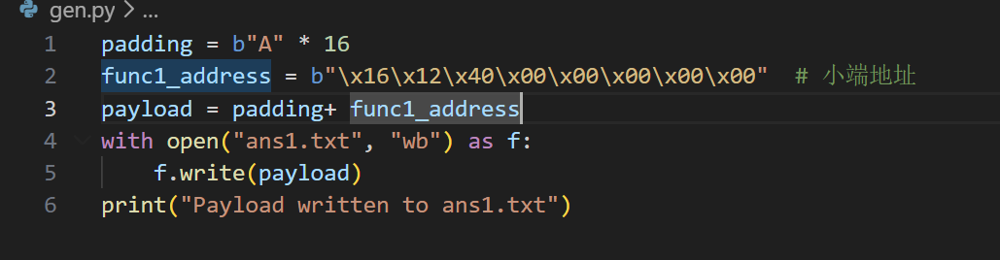
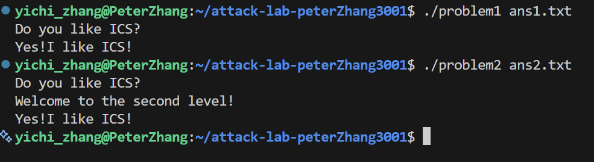
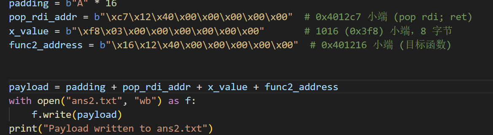
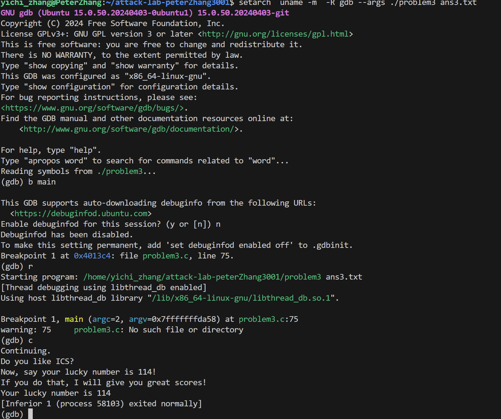
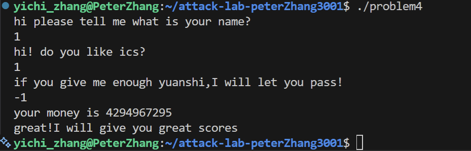

# 栈溢出攻击实验

## 题目解决思路

**前提：**readme里写的python文件的b“A”可能有点小错：b“A”是占一个字节（8b）而不是半个字节；加b的作用不是指示0xA，而是提示变量类型的改变，使得string变为bits，可以和bits串连接

p1到p3的ans.txt都在仓库里

### Problem 1: 
- **分析**：

反汇编出来，结合ida反编译的参考c代码，发现main里的很多分支都是判断txt文件是否成功打开以及是否有实际内容。

真正核心的部分是调用txt里的字符串进func。

如果func顺利执行，实验就失败了，所以需要利用func里ret这个能改变pc的机会，把程序进程改到func1上（gdb查到成功提示符在func1了）。

func里，程序栈是：

| +8   | 返回地址         |
| ---- | ---------------- |
| 0    | 旧rbp            |
| -8   | buffer开始的地方 |

知道buffer占8个B，旧rbp也占8B，所以padding16个char（A），然后小端法写func1的开始地址，就能覆盖原来的返回地址。

- **解决方案**：
- **结果**：

### Problem 2:
- **分析**：

进入隐藏函数的部分和p1差不多。

重点是，隐藏函数func2要检验一个传参是不是==0x3f8，这是个通过%edi的寄存器传参：现在需要找个办法修改edi的值。

因为唯一能做的是在栈上输入溢出信息，所以得（1）找个能沟通栈上信息和寄存器的手段，（2）得通过ret返回到接下来的邪恶控制流。

pop指令是一个解决（1）的好方法，所以pop加ret构成了我们需要的gadget。搜索已有代码，发现一个叫pop_rdi的函数正好有这个gadget。

所以，在padding后先接这个gadget的起始地址（func的ret“错误”跳到这里），然后接key值（0x3f8）（pop赋给rdi），然后接func1的起始地址（gadget的ret“错误”跳到这里）

- **解决方案**：
- **结果**：见p1

### Problem 3: 
- **分析**：

和p2一样有一个检验传参的环节，还是edi，但是没有pop_rdi了。

有两个方法，一个是通过给出的小函数凑出一些先把值赋给rax，再把rax赋给rdi的方法。

另一个是，既然readme里说可以关闭栈随机化，那么可以利用程序和libc加载代码之间的固定间隔调用libc里的gadget。

但是第二个办法我不会操作，AI教了我一些终端指令：

1.禁用栈随机化，gdb进入p3，main前打断点

2.找到libc里所有的pop+ret的gadget的offset

```python
data = open('/lib/x86_64-linux-gnu/libc.so.6','rb').read()
pat = b'\x5f\xc3'
for i in range(len(data)-1):
    if data[i:i+2] == pat:
        print(hex(i))
```

这段是直接在终端里运行的

3.利用程序调用的库函数确认libc的基址

```
(gdb) p/x (void*) puts               # 得到 puts_runtime
# 假设 objdump -T 给出的 puts 偏移是 0x87be0，则：
(gdb) set $libc_base = (void*)((long)(void*)puts - 0x87be0)
(gdb) p/x $libc_base + 0x2afcc       # 把 0x2afcc 换成pop;ret 偏移
(gdb) x/8i $libc_base + 0x2afcc
```

4.libc里的gadget地址等于libc的基址加offset

- **解决方案**：

  ```python
  from struct import pack
  padding = b"A"*40
  # 填入运行时计算出的 pop rdi gadget 地址：
  pop_rdi_addr = pack("<Q", 0x7ffff7d0f78b)   # <-- 运行时 libc 中 pop rdi gadget 地址
  val = pack("<Q", 0x72)
  func1 = pack("<Q", 0x401216)
  payload = padding + pop_rdi_addr + val + func1
  with open("ans3.txt","wb") as f:
      f.write(payload)
  print("wrote ans3.txt")
  ```

- **结果**：

### Problem 4: 
- **分析**：

main函数中存在对金丝雀的模拟，前面两段看似无用的对话其实是以一个随机字符串覆盖输入字符串的前部分，如果输入字符串试图溢出，caesar_decrypt检测就通不过。

- **解决方案**：p4是屏幕输入输出，在前两个对话输一些合法的糊弄糊弄，第三个对话要输一个“钱数”，这是一个利用高层语言逻辑漏洞而不是栈溢出的攻击：-1被解读为无符号极大值，并且好像只有-1能过，因为-1的无符号解释是最大的。
- **结果**：

## 思考与总结

1.ret是唯一能接触到的修改pc的窗口，要想更改程序行为，需要每一次邪恶跳转的地址都冲掉某一个ret的栈上参数。

2.借用已加载到内存里的text的已有片段修改需要的值

## 参考资料

